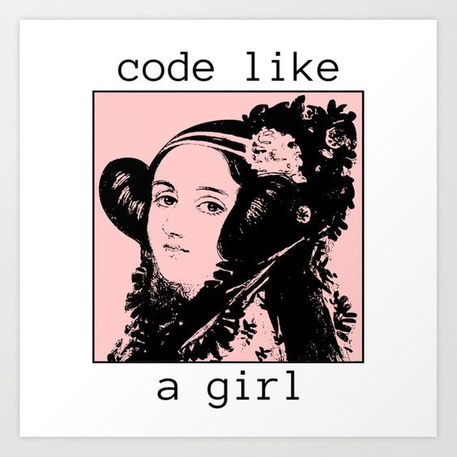

# Intro-Github

## Charla taller

Práctica para el programa Skills for women in tech

 Sesión de github

### Agregar imagen

Estoy prácticando**Markdown***style* en este commit desde la terminal (:
>esto es una blockquote (lo que sea que se eso)

Esta práctica es para complementar lo visto en Introducción a GitHub
